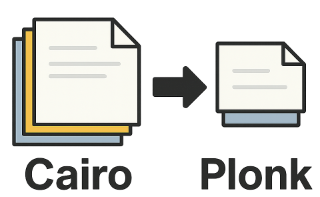

# Compressing Stwo-Cairo proof to Stwo-Plonk proof

This repository implements a recursive proof generator that converts a Stwo-Cairo proof into a smaller Stwo-Plonk proof, leveraging the fact that Stwo-Plonk proof has much fewer columns than Stwo-Cairo (2235 vs 134) and that the Cairo-to-Plonk verifier circuit is significantly smaller than that of Cairo-to-Cairo, which allows for more aggressive FRI parameters before reaching the Circle Stwo bound. Then, we repeatedly use Plonk-to-Plonk recursive verification with different FRI parameters to reduce the proof size. This is designed to reduce the on-chain footprint of a Stwo-Cairo proof to be verified on Zcash.

Special thanks to [Abdel Bakhta](https://x.com/AbdelStark) for scoping out the idea and engineering plan, and special thanks to [Michael Zaikin](https://x.com/monsieur_kus) for answering a number of questions related to Starknet and providing many ideas on proof compression.

**Contents**
- [Proof Sizes](#proof-sizes)
- [Assumptions](#assumptions)
- [Constructions](#constructions)
  - [Fiat-Shamir](#fiat-shamir)
  - [Composition](#composition)
  - [Decommitment](#decommitment)
  - [Answer](#answer)
  - [Folding](#folding)
- [Plonk-to-Plonk compression](#plonk-to-plonk-compression)
- [Additional documentations](#additional-documentations)

## Proof Sizes

| Proof File | Size | Description |
|------------|------|-------------|
| [`recursive_proof.bin.bz`](cairo-components/test_data/recursive_proof.bin.bz) | 1.19 MiB | From [zebra-fork](https://github.com/Ztarknet-recursion/zebra-fork/) and uses Stwo-Cairo to verify a proof from [SNOS][snos] Config: pow_bits = 26, log_last_layer_degree_bound = 0, log_blowup_factor = 1, n_queries = 70 |
| [`initial_proof.bin`](examples/data/initial_proof.bin) | 612 KiB | Verifies `recursive_proof.bin.bz` using Cairo-to-Plonk verifier Config: pow_bits = 26, log_last_layer_degree_bound = 0, log_blowup_factor = 1, n_queries = 70 |
| [`level1_20_8_1.bin`](examples/data/level1_20_8_1.bin) | 399 KiB | Verifies `initial_proof.bin` using Plonk-to-Plonk verifier Config: pow_bits = 20, log_last_layer_degree_bound = 8, log_blowup_factor = 1, n_queries = 80 |
| [`level2_20_8_3.bin`](examples/data/level2_20_8_3.bin) | 191 KiB | Verifies `level1_20_8_1.bin` using Plonk-to-Plonk verifier Config: pow_bits = 20, log_last_layer_degree_bound = 8, log_blowup_factor = 3, n_queries = 27 |
| [`level3_23_8_7.bin`](examples/data/level3_23_8_7.bin) | 98 KiB | Verifies `level2_20_8_3.bin` using Plonk-to-Plonk verifier Config: pow_bits = 23, log_last_layer_degree_bound = 8, log_blowup_factor = 7, n_queries = 11 |
| [`level4_20_8_8.bin`](examples/data/level4_20_8_8.bin) | 86 KiB | Verifies `level3_23_8_7.bin` using Plonk-to-Plonk verifier Config: pow_bits = 20, log_last_layer_degree_bound = 8, log_blowup_factor = 8, n_queries = 10 |
| [`level5_28_7_9.bin`](examples/data/level5_28_7_9.bin) | 77 KiB | Verifies `level4_20_8_8.bin` using Plonk-to-Plonk verifier Config: pow_bits = 28, log_last_layer_degree_bound = 7, log_blowup_factor = 9, n_queries = 8 |

## Assumptions

The Cairo-to-Plonk verifier circuit expects that the Cairo program in the Cairo proof is [a Cairo-to-Cairo recursive verifier][cairo-recursive-verifier] executed by [the simple bootloader](https://github.com/Ztarknet-recursion/zebra-fork/blob/m-kus/compress-proof/zebra-prove/bootloaders/simple_bootloader_compiled.json), with feature flags `qm31_opcode` and `blake_outputs_packing` and the config with pow_bits = 26, log_last_layer_degree_bound = 0, log_blowup_factor = 1, and n_queries = 70. See [this doc](doc/example_proof.md) for more detail.

This would result in the Cairo proof to have certain shapes and parameters below that we take as assumptions.

- The bootloader emits 5 outputs, each of [u32; 8]. 
- The entire Cairo program uses the Stwo-Cairo AIR in the following way. The Cairo-to-Cairo recursive verifier should have the same AIR usage for all Cairo proofs being verified.
   * It uses `add`, `add_small`, `add_ap`, `assert_eq`, `assert_eq_imm`, `assert_eq_double_deref`, `blake`, `call`, `call_rel_imm`, `jnz`, `jnz_taken`, `jump_rel`, `jump_rel_imm`, `mul`, `mul_small`, `qm31`, `ret` opcode components, but it does not use `generic`, `jump`, `jump_double_deref`.
   * It uses the `range_check_128` builtin only, and does not use `add_mod`, `bitwise`, `mul_mod`, `pedersen`, `poseidon`, `range_check_96` builtins.

We do not make assumptions on the log sizes of each component in the Cairo-to-Cairo circuit. The Cairo-to-Plonk verifier is designed to be use one circuit to handle all log size variations. 

## Constructions

We now discuss the constructions of the new components (listed in [this doc](doc/components.md)) in the Cairo-to-Plonk verifier circuit.

### Fiat-Shamir

Compared with a standard Stwo's Fiat-Shamir transform, the one for Cairo has some notable differences:

- It needs to verify that the claim follows [a list of requirements](https://github.com/Ztarknet-recursion/stwo-cairo-fork/blob/main/stwo_cairo_prover/crates/cairo-air/src/verifier.rs#L29) about the Cairo memory spaces and relation uses. See [this doc](doc/formality_check.md) for more detail.
- The verifier parameters can pre-absorb (hardcode) the program segments for efficiency.
- It needs to perform an interaction PoW with 24 bits.
- The public memory sections are treated as public input. See [this doc](doc/public_input.md) for more detail.

To ensure that Fiat-Shamir does not depend on the log sizes of each component, there are a few techniques being used:

- When absorbing the sampled values (around the OODS point), it needs to skip the values for unused "Seq" preprocessed trace columns, which depends on the log sizes of components that use "Seq". To handle this, we use a primitive called [ConditionalChannelMixer](primitives/src/channel.rs) so that the circuit is oblivious to whether a "Seq" preprocessed trace column will be present.
- The number of inner layers in FRI depends on the degree of the FRI polynomial, which has to do with the max log sizes of all the components. To handle this, the Fiat-Shamir assumes `MAX_SEQUENCE_LOG_SIZE - 1` inner layers where some of them are dummy and can be ignored obliviously using the computed actual log size of the FRI polynomial, based on the max log sizes of all components.

### Composition

We adapt the Cairo AIR [here](cairo-components/recursive/composition/components) to handle the issue that some Cairo components use "Seq" preprocessed column in a way that depends on their respective log size, and some Cairo components use log sizes within its own evaluation (`range_check_builtin_bits_128` and `memory_address_to_id`). In addition, since a component can have different log sizes, it impacts the way to compute the denominator inverses in the composition polynomial. 

- a primitive called [ObliviousMapVar](primitives/src/oblivious_map.rs) is to used to find the point shift constants that vary by log sizes during the computation of the denominator inverses (coset vanishing) for constructing the composition polynomial.
- a primitive called [PointEvaluatorVar](cairo-components/recursive/composition/src/data_structures.rs) that mimics the `PointEvaluator` in Stwo which additionally supports "seq franking", so that we can replace the direct invocation of the "Seq" preprocessed trace column with an oblivious one. This is used for a number of components whose usage of the "Seq" preprocessed trace column depends on their own log sizes (which is the expected behavior).

### Decommitment

We design decommitment to be oblivious to the log sizes of each component with two designs:

- Merkle tree verification is oblivious to the Merkle tree sizes. This is useful because trace, interaction, and composition trees' heights depend on the log sizes of the components. The Merkle tree verification assumes the maximum size `MAX_SEQUENCE_LOG_SIZE + log_blowup_factor` but can skip bottom layers conditionally according to the computed tree height.
- Some Merkle tree nodes carry column values at that height, but the heights here depend on the log sizes of the components, and even the number of columns residing at a specific height is not a constant. Several primitives are built [here](cairo-components/recursive/decommitment/src/utils.rs) to apply the column values obliviously, by creating a number of hash accumulators that can be obliviously selected and can correctly batch M31 elements in order in calculating the hash even if those M31 elements come from different components. 

### Answer

Using the queried values, we can compute the FRI answers on queried points, which are later used to verify the FRI opening. Some components have changing log sizes, and therefore the code computes the FRI answers incrementally and in a way that is oblivious to the log sizes of each component. 

- it uses an oblivious way to get the cached denominator inverses, the shifted OODS point (for interaction), and the domain point's coordinates at a specific log size. 
- it uses [AnswerAccumulator](cairo-components/recursive/answer/src/data_structures.rs) to incrementally and obliviously update the list of answers of each log size.

### Folding

Folding will fold the FRI polynomial until it becomes a constant. The number of foldings needed, as well as the height of the trees for each folding, depends on the log sizes of the components. The code uses two designs to make the folding logic independent on the log sizes.

- for the first layer, the tree assumes the maximum height `MAX_SEQUENCE_LOG_SIZE + log_blowup_factor` and can skip layers based on the computed log size. 
- for the inner layers, we pad to the maximum number of inner layers from `MAX_SEQUENCE_LOG_SIZE - 1 + log_blowup_factor` to `log_blowup_factor` and can obliviously skip inner layers that are due to padding. 

The folded result is then checked against the last layer constant, which should be the same across all the queries. 

## Plonk-to-Plonk compression

After the initial Cairo-to-Plonk step, the Plonk proof is made smaller by recursively verifying it but under more aggressive FRI parameters that reduce the proof size. An invariant of the recursion is that the public input to any of the Plonk proof is (1, i, j, A, B) where A and B are both QM31 elements and they together form the Poseidon2 hash for the 5 outputs from the bootloader, each of [u32; 8]. 

To verify the final Plonk proof, one needs to get the final preprocessed column hash (which depends on and *is sensitive to* the chain of Plonk-to-Plonk compression) and generates the input as above with the expected outputs from the [SNOS][snos] proof. 

## Additional documentations

These documentations discuss some new designs in this repository.

- [Description of the example proof being verified](doc/example_proof.md)
- [List of components in Cairo](doc/components.md)
- [Cairo proof formality checks](doc/formality_check.md)
- [Public input in a Cairo proof](doc/public_input.md)

[cairo-recursive-verifier]: https://github.com/Ztarknet-recursion/zebra-fork/blob/m-kus/compress-proof/zebra-prove/recursion/src/lib.cairo
[snos]: https://github.com/keep-starknet-strange/snos